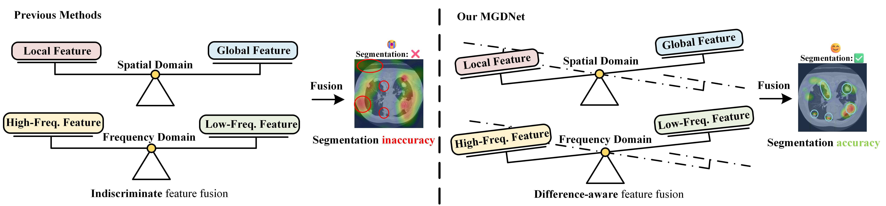
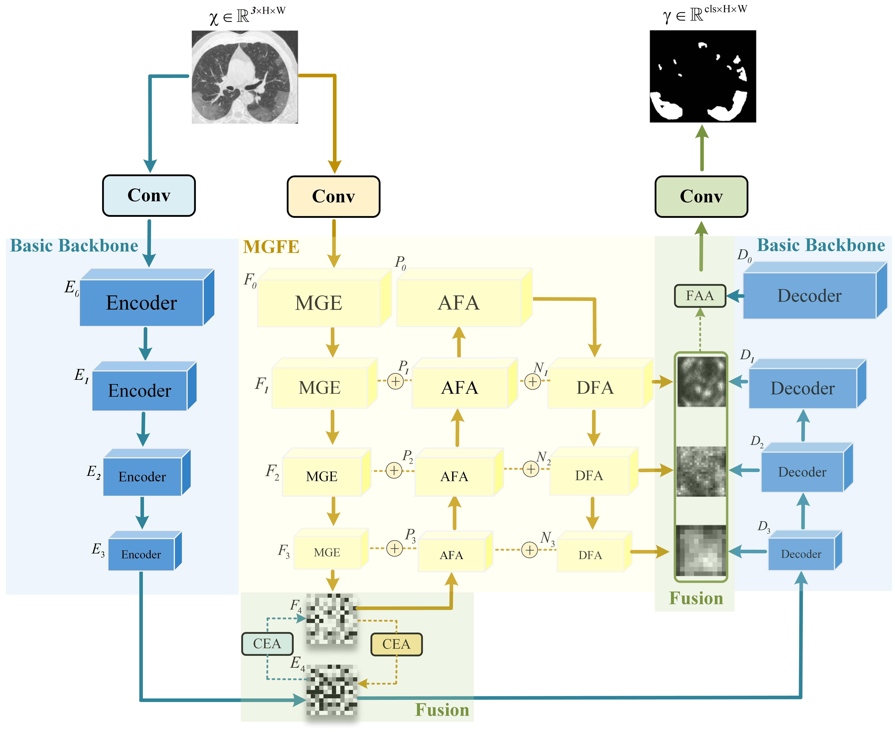
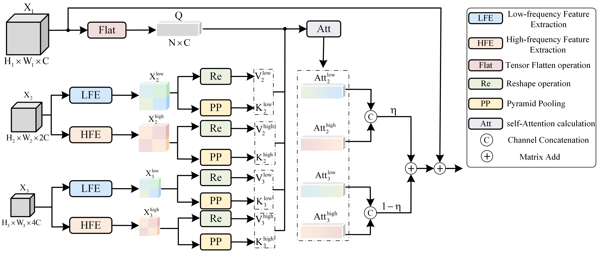
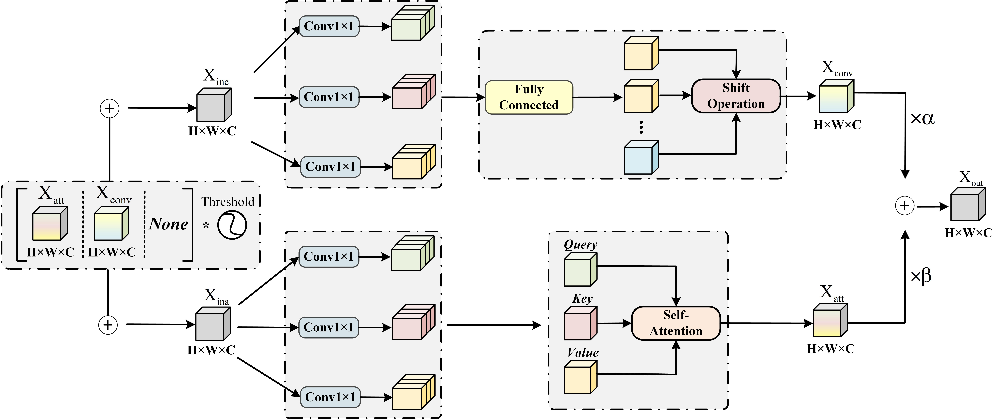

# MGDNet: Multi-Granularity Difference-aware Network for Pulmonary Lesion Segmentation

[](https://github.com/wzydcg/MGDNet)
[](https://github.com/wzydcg/MGDNet)


---

## Introduction

## Approach



## Frequency-Aware Attention


## Conditional-Enhanced Attention


## Experimental results


## Training

### Default Scripts
All default hyperparameters among these models are tuned for Lung lesion datasets.

Wandb is needed if visualization of training parameters is wanted

### Customized Execution

run script like this:
```bash
python main.py \
--model MGDNet \
--dataset RAOS \
--batch_size 4 \
--num_epochs 200 \
--learning_rate 1e-4 \
--dropout 0.1 \
--do_train \
--do_evaluate
```

## Dependencies
- python==3.12
- opencv-python==4.7.0.68
- einops
- nilearn==0.10.4
- scikit-learn==1.3.2
- scipy
- torch==2.3.0
- pydicom==2.4.4
- pandas==1.5.3
- nibabel==5.2.1
- wandb

